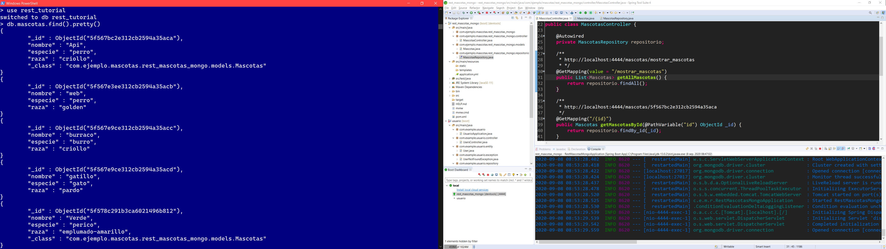
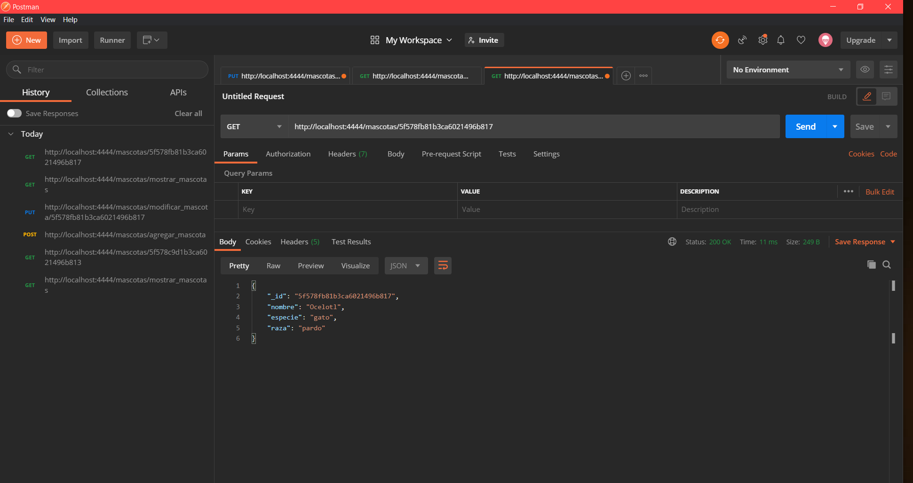
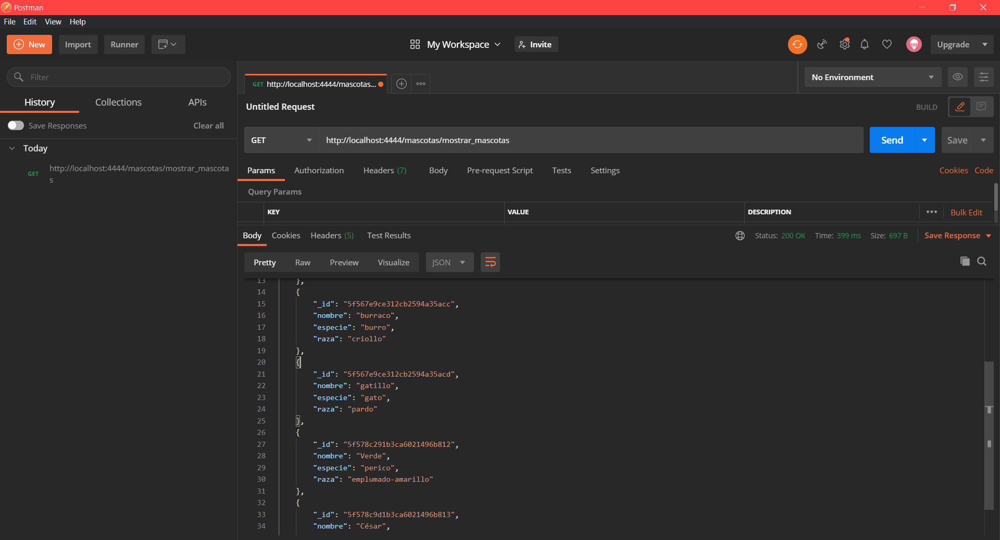
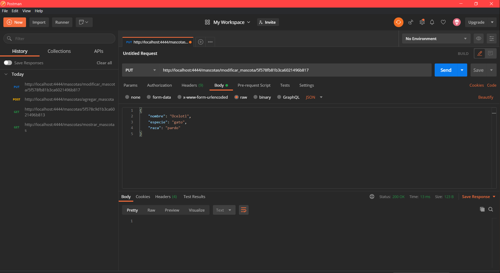
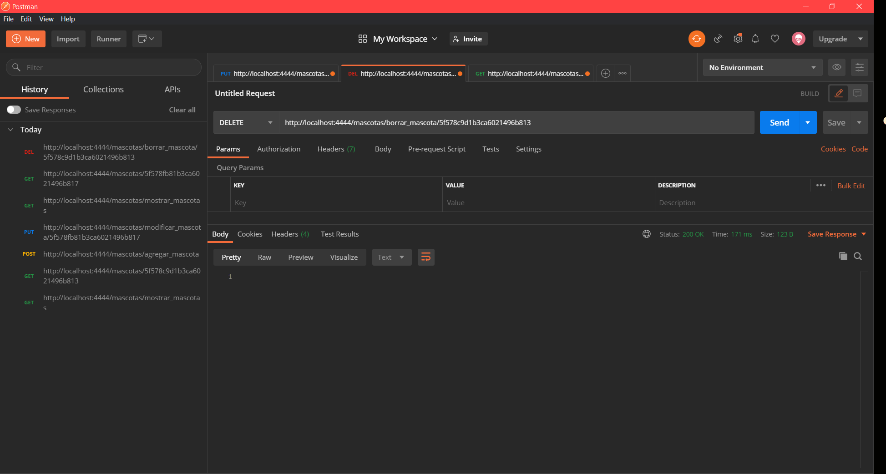

# crud_mongo_spring2

Api básica creada con Spring Boot 2.3.2, persistiendo datos con mongoDB 


```
Base de datos de mongo desde la consola:
``` 
<p align="center">
  
</p>

```
Realizando las consultas al crud usando POSTMAN:
``` 
<p align="center">
  
   
</p>

<p align="center">
  
   
</p>

<p align="center">
  
</p>
